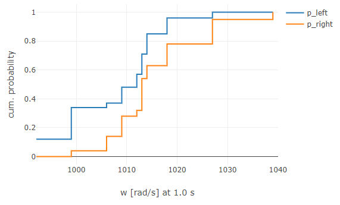

# UNCERTAINTY

The Uncertainty package provides methods to quantify the uncertainty behind simulation results.

* [`createCumulativeHistogram`](#createcumulativehistogram):
* [`createPBoxes`](#createpboxes):

## `createCumulativeHistogram`

To create cumulative distributions from simulation results, the function `createCumulativeHistogram` can be used. It will generate a discrete cumulative distribution, with the intervals of the discrete values, i.e. the sorted values with associated cumulative probabilities, which can be used to generate P-Boxes.

### Usage

To create a distribution, either an array of discrete values can be passed to the function:

```javascript
const discreteValues = [1036.1, 998.5, 1030.8, 1026.0, 1017.2, 1025.3, 1042.8, 992.7];
const cumHist = createCumulativeHistogram(discreteValues);

// cumHist
// {
//     type: "CDF",
//     x: [992.7, 998.5, 1017.2, 1025.3, 1026.0, 1030.8, 1036.1, 1042.8],
//     p: [0.125, 0.25, 0.375, 0.5, 0.625, 0.75, 0.875, 1],
//     unit: "unknown"
// }
```

The recommended way of using `createCumulativeHistogram`,is to use an array of [Signals](https://github.com/virtual-vehicle/Credibility-Assessment-Framework/tree/main/Credibility-Development-Kit/util/signal) with a corresponding evaluation function that will return a number:

```javascript
const discreteValues = [signal1, signal2, signal3, signal4, signal5]; // rotational speed of a DC motor
const evalFn = signal => signal.value(1.0) - 1000; // the difference of the rotational speed at 1.0 seconds to 1000 rad/s

const cumHist = createCumulativeHistogram(discreteValues, evalFn);

// cumHist
// {
//     type: "CDF",
//     x: [-9.3, 11.2, 19.6, 27.7, 49.3],
//     p: [0.2, 0.4, 0.6, 0.8, 1],
//     unit: "rad/s"
// }
```

## `createPBoxes`

The function is used to create [*Probability Boxes*](https://en.wikipedia.org/wiki/Probability_box) that can be used to characterize the uncertainty of simulation results including aleatory **and** epistemic uncertainties. The approach to use it for simulation results has been proposed by C. Roy and W. Oberkampf [^1].

### Usage

The `createPBoxes` function expects an array of [cumulative distributions](#createcumulativehistogram), where each cumulative distribution represents simulation results, that have been parametrized with  **a single epistemic parameter combination** and **several aleatory parameter samples** (each point of the cumulative distribution represents a simulation result of a specific parameter combination of the parameters with aleatory uncertainties, i.e. one array element from the first dimension generated with the [`createSamples` function of the Parameter module](https://github.com/virtual-vehicle/Credibility-Assessment-Framework/tree/main/Credibility-Development-Kit/util/parameter#createsamples)).

If only the array of cumulative distributions is passed, the minimum and maximum of random variable (i.e., the SRQ) will be chosen according to the actual occuring minimum and maximum values of all distributions. The interval will be selected automatically to the least significant digit that is occuring throughout all values.

```javascript
const cds = [cumHist1, cumHist2, cumHist3, cumHist4];
const pBoxes = createPBoxes(cds);

// pBoxes
// {
//     x: [998, 999, 1000, 1001, 1002, 1003, 1004, 1005, 1006, 1007],
//     p_upper: [0.12, 0.34, 0.37, 0.48, 0.57, 0.71, 0.80, 0.89, 1, 1],
//     p_lower: [0, 0, 0.14, 0.28, 0.32, 0.54, 0.63, 0.78, 0.95, 1],
//     unit: "rad/s",
// }
```



The minimum, maximum and interval values can be specified optionally, by passing these values to the function via an object.

If the minimum and maximum values are specified not generously enough, it's likely that the whole range from 0 to 1 is not covered.

```javascript
const cds = [cumHist1, cumHist2, cumHist3, cumHist4];
const config = {
    x_min: 999,
    x_max: 1001,
    interval: 0.5
};

const pBoxes = createPBoxes(cds, config);

// pBoxes
// {
//     x: [999, 999.5, 1000, 1000.5, 1001],
//     p_upper: [0.34, 0.35, 0.37, 0.40, 0.48],
//     p_lower: [0, 0, 0.14, 0.21, 0.28],
//     unit: "rad/s",
// }
```


Optionally, an offset in the form of an epistemic uncertainty can be passed to the function, to ingest other uncertainties, as for example numeric uncertainties or the model form uncertainty:

```javascript
const cds = [cumHist1, cumHist2, cumHist3, cumHist4];
const offset = 1.0;
const pBoxes = createPBoxes(cds, offset);

// pBoxes
// {
//     x: [997, 998, 999, 1000, 1001, 1002, 1003, 1004, 1005, 1006, 1007, 1008],
//     p_upper: [0.12, 0.34, 0.37, 0.48, 0.57, 0.71, 0.80, 0.89, 1, 1, 1],
//     p_lower: [0, 0, 0, 0, 0.14, 0.28, 0.32, 0.54, 0.63, 0.78, 0.95, 1],
//     unit: "rad/s",
// }
```


Of course for a P-Box with an offset, the boundaries and interval can be given, as well. The arguments need to be passed in the following order:

```javascript
const cds = [cumHist1, cumHist2, cumHist3, cumHist4];
const offset = 1.0;
const config = {
    x_min: 999,
    interval: 0.5
    // x_max will be determined automatically in this case!
};
const pBoxes = createPBoxes(cds, offset, config);
```

[^1]: Christopher John Roy, William L. Oberkampf (2010). A Complete Framework for Verification, Validation, and Uncertainty Quantification in Scientific Computing (Invited). *In: 48th AIAA Aerospace Sciences Meeting Including the New Horizons Forum and Aerospace Exposition.* Orlando, USA. DOI: 10.2514/6.2010-124
